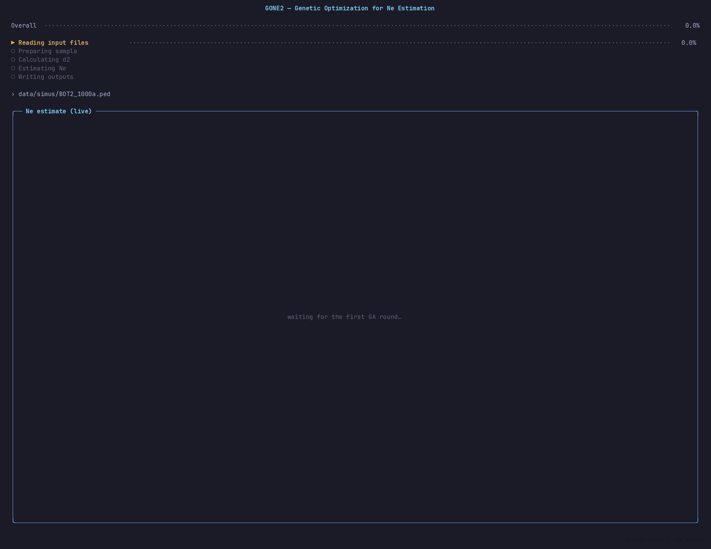

# GONE2
Demographic history from the observed spectrum of linkage disequilibrium



This repository is a fork of the original [esrud/GONE2](https://github.com/esrud/GONE2).
To the best of our knowledge this fork's `main` branch produces the same
results as the upstream version, but we have not run enough tests to confirm
it across every input format and option combination. If you spot a difference,
please open an [issue](../../issues) — a minimal reproducer (input file plus
the exact command line) is enough.

An experimental branch (`experiments/ga-exploration`) is also maintained on
this repo. We'd love help testing it — try it on your own data and let us
know what you find via an [issue](../../issues), good or bad. See
[EXPERIMENTAL.md](EXPERIMENTAL.md) for what changes and how to switch.

# System requirements
## Hardware requirements
`gone2` requires only a standard computer with enough RAM to support the in-memory operations.
# Software requirementes
## OS Requirements
This program has been tested on the following operating systems but should work on most linux distributions
    - Linux: Ubuntu 20.04, Arch Linux (kernel 6.11.6), Debian Buster
## Software required for compiling
### g++
It should be included in (almost) every linux distribution. To install it in debian-like distributions:
```
sudo apt install g++
```
### make
This is only needed if you want to use the make commands to compile the program. You could directly compile it using g++.To install it just run the following command (in debian-like distributions):
```
sudo apt install make
```
### openmp
Depending on your operating system, you may need to install openmp
```
sudo apt install libomp-dev
```
### libncurses (only for `make gone-ncurses`)
The interactive ncurses build links against the wide-character ncurses
library. On Debian-like distributions:
```
sudo apt install libncursesw5-dev
```
# Installation
It is recommended that you compile the source code, since it will most likely be faster.

## Compiling
Clone the github repo:
```
git clone https://github.com/esrud/GONE2
```
Compile:
```
cd GONE2
make gone
```
This program makes an extensive use of memory. By default it's limited to 2.000.000 loci and 1000 samples/individuals. You can change this by compiling with:
```
g++ -fopenmp -DMAXLOCI=YOUR_NUMBER_OF_LOCI -DMAXIND=YOUR_NUMBER_OF_INDIVIDUALS -O2 -o gone2 gone2.cpp lib/*.cpp
```
If you use the *make* command, it can also be customized in a similar way:
```
make MAXLOCI=YOUR_NUMBER_OF_LOCI MAXIND=YOUR_NUMBER_OF_IND gone
```
### Interactive ncurses UI
To build the ncurses-based interactive interface alongside the standard binary:
```bash
make gone-ncurses
./gone-ncurses [OPTIONS] <file_name_with_extension>
```
`gone-ncurses` renders a live chart of the inferred Ne curve and progress detail while the analysis runs. It requires `libncursesw` (`sudo apt install libncursesw5-dev` on Debian-like distributions). The standard `make gone` target still builds the original `gone2` binary.

### MacOS
On MacOS you can compile it by running:
```
make macos
```
This assumes that the installed version of OpenMP is 19.1.5. You may need to change this in the Makefile to the version installed on your system, by modifying the MAC_PATH_OPENMP variable. We would appreciate if you could let us know whether this worked on your system.

# Usage
```
GONE2 - Genetic Optimization for Ne Esimation (v2.0 - Jan 2024)
Authors: Enrique Santiago - Carlos Köpke
       This software estimates past demography from the distribution of LD
       between pairs of SNP located at different distances on a genetic map.

USAGE: ./gone2 [OPTIONS] <file_name_with_extension>
       Where file_name is the name of the data file in vcf, ped or tped
           format. The filename must include the .vcf, .ped or tped
           extension, depending on its format.
       Estimates are made using the genetic map available in the .tped
           file, when using the tped format, or in an accompanying .map file,
           when using the ped or vcf formats. This .map file has the same
           name as the .ped or .vcf data file and must be located in the
           same directory as the data file. When a constant recombination           rate per Mb is assumed (option -r), the physical map is used to
           infer an approximate genetic map, and the detailed genetic map
           information in the data file is ignored, if available.
       Three files are created with the following extensions:
           _GONE_Ne: Estimates of Ne backward in time.
           _GONE_d2: Number of SNP pairs used in the analysis, observed LD
                 (weighted squared correlation d2) and predicted LD per bin
                 of recombination frequency.
           _GONE_STATS: Summary statistics.

OPTIONS:
    -h     Print out this help
    -g     Type of genotyping data. 0:unphased diploids; 1:haploids;
           2:phased diploids; 3:low-coverage (0 by defauld). Low-coverage
           assumes diploid unphased genotypes and can be used with any
           distribution of coverage within and between individuals.
    -x     The sample is considered to be a random set of individuals from
           a metapopulation with subpopulations of equal size.
    -b     Average base calling error rate per site (0 by default).
    -i     Number of individuals to use in the analysis (all by default)
    -s     Number of SNPs to use in the analysis (all by default)
    -t     Number of threads to be used in parallel computation (default: 4)
    -l     Lower bound of recombination rates to be considered (default: 0.001)
    -u     Upper bound of recombination rates to be considered (default: 0.05)
    -e     Reinforcement estimates of recent generations
    -r     If specified, constant rec rate in cM/Mb across the genome
    -M     If specified, minor allele frequency cut-off
    -o     Specifies the output filename. If not specified, the output
           filename is built from the name of the input file.
    -S     Integer to seed random number generator. Taken
           from the system, if not given.
    -f     Path to a reference Ne-history file (simu params or
           per-generation Gen/Ne table). The ncurses TUI build
           overlays this curve in red so estimates can be eyeballed
           against ground truth.

EXAMPLES:
    - Analysis of high quality diploid unphased data in "file.ped" (PLINK
      format) assumes a constant recombination rate of 1.1 cM per Mb across
      the genome (no need for a detailed genetic map within the .map file).
      16 threads will be used:
          ./gone2 -r 1.1 -t 16 file.ped
    - A subsample of 10000 SNPs of the individuals in "file.ped" assuming
      assuming that they were randomly sampled from a metapopulation composed
      of two subpopulations:
          ./gone2 -x -s 100000 file.ped
    - Analysis of diploid high quality phased data in "file.vcf" (format vcf).
      assumes that the genetic locations of the SNPs are given in the
      "file.map" file (PLINK format) available in the same directory:
          ./gone2 -g 2 file.vcf
    - Analysis of diploid high quality phased data in "file.vcf" (format vcf).
      assumes a constant recombination rate of 1.1 cM per Mb across the genome:
          ./gone2 -g 2 -r 1.1 file.vcf
    - Analysis of diploid high quality unphased data in a .tped file,
      performed on a radom subset of 50 individuals and 100,000 SNPs.
          ./gone2 -i 50 -s 10000 file.tped
    - Analysis of low quality unphased data in a .tped file containing the
      locations on a genetic map. Low-coverage (no need to specify depth) and
      a genotyping error rate of 0.001 across genomes are assumed.
          ./gone2 -g 3 -b 0.001 file.tped
```

### Reference Ne-history file formats (`-f`)

Two layouts are accepted.

**Per-generation `Gen Ne` table** (tab- or space-separated, `Gen=0` is the
most recent generation; gaps are constant-extended from the previous Ne):

```
Gen     Ne
0       1000
1       1011.49
2       922.05
3       840.52
...
```

**Simu-params block** (the format produced by our simulator). Everything
before the `EL PRIMER BLOQUE` comment is ignored; the trailing
`Ne nGenerations` rows are read oldest-first and expanded into one Ne value
per generation:

```
# (any header/comment lines, parameter values, etc. are skipped)
# indiv_diploides generaciones.
# EL PRIMER BLOQUE ES EL DE EQUILIBRIO Y SE USA UN SOLO CROMOSOMA:
1000 20000
1000 10000
100  25
1000 10
```
The block above describes: 20 000 generations at Ne=1 000 (equilibrium),
10 000 at Ne=1 000, 25 at Ne=100 (a bottleneck), then 10 at Ne=1 000.

